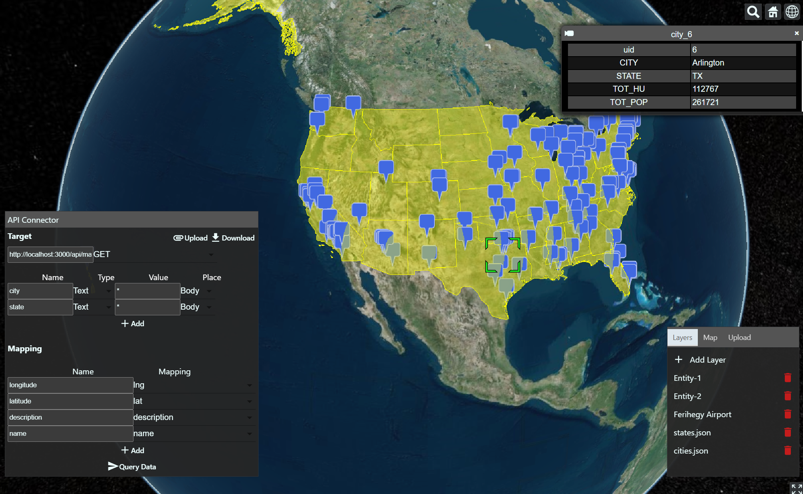

# Map Handler

This is a Generic Map Visualization project that uses Vite, React, and CesiumJS.
With this project we can view GeoJSON, KML, KMZ and other Geospatial objects from multiple sources. (File, Remote API)

## Features
 - Manage different datasources, and entities as layers
 - Load Geojson, Gltf, KML, KMZ Geospatial and/or model data to the 3D Globe
 - Connect Remote API to receive GeoJSON




## Installation
To install and run the project locally, follow these steps:

 - Clone the repository to your local machine: git clone https://github.com/Reterics/map-handler
 - Install dependencies by running
    ```bash
    npm install
    ```
 - Build the project by running npm run build or yarn build
    ```bash
    npm build
    ```
 - Start the development server by running npm run dev or yarn dev
    ```bash
    npm dev
    ```
 - Open your web browser and navigate to http://127.0.0.1:5173/

## Contribute

There are many ways to [contribute](https://github.com/Reterics/map-handler/blob/main/CONTRIBUTING.md) to Map Handler.
* [Submit bugs](https://github.com/Reterics/map-handler/issues) and help us verify fixes as they are checked in.
* Review the [source code changes](https://github.com/Reterics/map-handler/pulls).
* [Contribute bug fixes](hhttps://github.com/Reterics/map-handler/blob/main/CONTRIBUTING.md).

