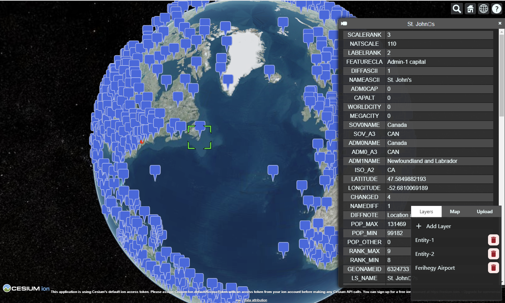

# Project Map Handler
This is a project that uses Vite, React, and CesiumJS, all with TypeScript.

# Table of Contents
1. [Description](#Description)
2. [Installation](#Installation)
3. [Usage](#Usage)
4. [Contributing](#Contributing)
5. [License](#License)

## Description


This project is a web application that integrates CesiumJS, a 3D globe and map rendering engine, with React, a popular front-end JavaScript library, using Vite as the build tool. The project is written in TypeScript, a typed superset of JavaScript, for improved developer experience and code maintainability.

## Installation
To install and run the project locally, follow these steps:

 - Clone the repository to your local machine: git clone https://github.com/RedAty/map-handler
 - Install dependencies by running
    ```bash
    npm install
    ```
 - Build the project by running npm run build or yarn build
    ```bash
    npm build
    ```
 - Start the development server by running npm run dev or yarn dev
    ```bash
    npm dev
    ```
 - Open your web browser and navigate to http://127.0.0.1:5173/

## Usage
Once you have the project running, you can interact with the 3D globe and map by using the user interface provided by the React components. The CesiumJS engine is integrated with React using the react-cesium package, which provides a set of pre-built CesiumJS components that can be easily used in a React application.

## Contributing
If you would like to contribute to this project, please follow these steps:

- Fork the repository to your own GitHub account
- Create a new branch with a descriptive name for your feature or bug fix
- Make changes to the code on your branch
- Push your changes to your forked repository
- Open a pull request to the original repository with a description of your changes

## License
This project is licensed under the MIT License.
